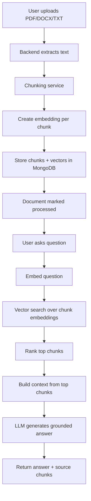

# AI Study Companion for Exams

This is a full-stack RAG-based study assistant where users upload study material, then ask questions, generate summaries, and create quizzes from their own documents.

## Tech Stack
- Frontend: React
- Backend: Node.js, Express
- Database: MongoDB (documents + chunks + embeddings)
- LLM/Embeddings: OpenAI-compatible endpoints

## End-to-End Flow



## Upload/Indexing Pipeline

```mermaid
flowchart LR
  U1[Upload file] --> U2[Text extraction]
  U2 --> U3[chunkText(text, 900, 180)]
  U3 --> U4[For each chunk: save metadata]
  U4 --> U5[For each chunk: create embedding]
  U5 --> U6[Store embedding in chunk record]
  U6 --> U7[Update document: processed=true, chunkCount]
```

## How Chunking Is Done
- Chunking is implemented in `backend/src/utils/chunking.js`.
- `chunkText(text, size, overlap)` uses a sliding window.
- In production flow (`textService.js`), it is called as:
  - `size = 900` characters
  - `overlap = 180` characters
- So each next chunk starts at `start + (900 - 180) = start + 720`.
- Why overlap is used:
  - Preserves continuity across chunk boundaries.
  - Reduces risk of splitting an important sentence/concept exactly at the edge.

## How Answer Retrieval Works
- Question comes to `POST /api/chat/query`.
- Backend embeds the question (`embeddingService.embedText`).
- `vectorService.search` computes cosine similarity between:
  - question embedding
  - each chunk embedding for selected document/user
- Top results are ranked and filtered (`chatController`).
- Context is built by concatenating top chunk texts.
- LLM is prompted with:
  - context from retrieved chunks
  - current user question
- Response returns:
  - `answer`
  - `sources` (chunk index + preview + score)

## Key Backend Files
- `backend/src/services/textService.js`: extraction -> chunking -> embedding -> save.
- `backend/src/utils/chunking.js`: sliding window chunk logic.
- `backend/src/services/vectorService.js`: cosine similarity search.
- `backend/src/controllers/chatController.js`: query pipeline and response shaping.
- `backend/src/services/llmService.js`: LLM call and fallback behavior.

## Notes
- If OpenAI keys/endpoints are not configured, embedding/LLM behavior falls back and answer quality can drop.
- Full architecture and API references are in `docs/`.
